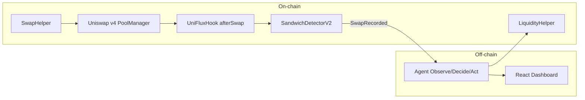
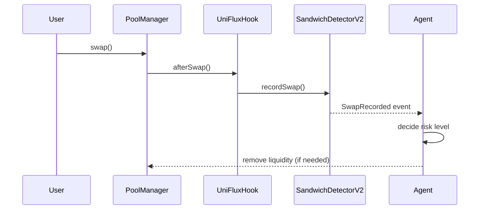
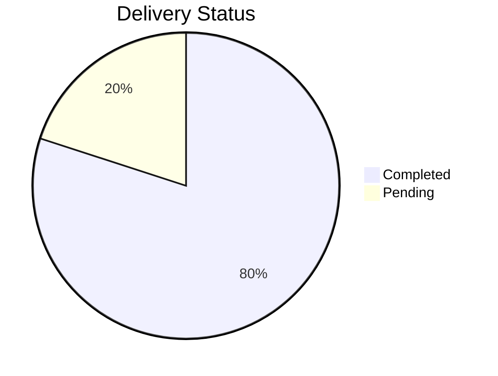
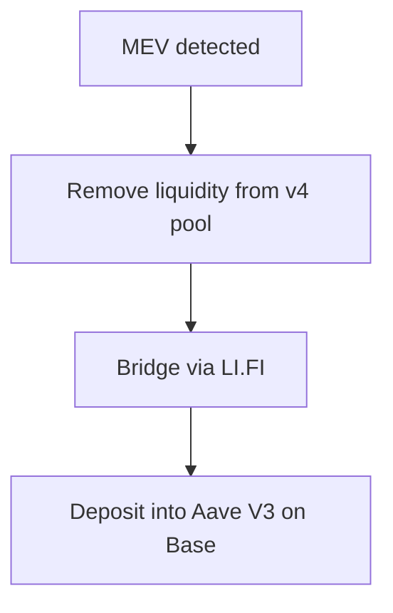

# UniFlux

Uniswap v4 agentic liquidity protection with on-chain MEV detection, a deterministic decision loop, and automated liquidity response.

**Submission**: Uniswap v4 Agentic Finance Hackathon
**ENS**: uniflux.eth -> 0xed0081BB40b7Bf64D407Ec25a99475d0BB8ed903

**Project status**
- MEV simulation complete (three on-chain transactions)
- Autonomous agent operational (observe-decide-act loop)
- Smart contracts deployed on Unichain Sepolia
- v4 hook design complete and documented
- Hook deployment pending v4 dependency resolution; see [docs/HOOK_DEPLOYMENT_STATUS.md](docs/HOOK_DEPLOYMENT_STATUS.md)

## Executive Summary

UniFlux provides deterministic, v4-native MEV protection for Uniswap v4 pools. A minimal `afterSwap` hook records swap data on-chain, a detector identifies sandwich patterns without oracles, and a TypeScript agent decides when to remove liquidity or trigger protective actions. The system has been validated with a real sandwich attack on Unichain Sepolia.

## System Overview

### Architecture



### Swap-to-Decision Flow



### Delivery Status Chart



## Key Capabilities

- Deterministic sandwich detection without external price oracles
- v4-native `afterSwap` integration for atomic, composable protection
- Off-chain decision loop with liquidity removal and alerting
- On-chain evidence with verifiable transactions on Unichain Sepolia
- React dashboard for live monitoring and control

## On-Chain Evidence

**Sandwich simulation (Unichain Sepolia)**

| Step | Transaction | Block | Role | Explorer |
|------|-------------|-------|------|----------|
| 1 | 0xa5458ebe... | 43458620 | Attacker frontrun | https://sepolia.uniscan.xyz/tx/0xa5458ebedc6893fff8b704875cfb00862a0f45a95fedd42fa239aa615c3f41a5 |
| 2 | 0xbd6c7902... | 43458649 | Victim swap | https://sepolia.uniscan.xyz/tx/0xbd6c79025e88c35497e832823f27813a8f30f833c00fe1c4ff39d2f73479ec0c |
| 3 | 0xbce8cf85... | 43458676 | Attacker backrun | https://sepolia.uniscan.xyz/tx/0xbce8cf85b346bd210df9dcf0991f078e8039492d7cc52a1613bc77b3b9768481 |

**Reference**: [docs/MEV_SIMULATION_SUMMARY.md](docs/MEV_SIMULATION_SUMMARY.md)

## Uniswap v4 Native Hook

UniFlux integrates directly into Uniswap v4 via a minimal `afterSwap` hook. Pools opt in at creation by setting the hook address, enabling native MEV protection without external relays.

```solidity
contract UniFluxHook is BaseHook {
    ISandwichDetector public immutable detector;

    function afterSwap(
        address sender,
        PoolKey calldata key,
        IPoolManager.SwapParams calldata,
        BalanceDelta delta,
        bytes calldata
    ) external override returns (bytes4, int128) {
        bytes32 poolId = key.toId();

        detector.recordSwap(
            poolId,
            sender,
            delta.amount0(),
            delta.amount1(),
            sqrtPriceX96After
        );

        emit UniFluxHookTriggered(...);
        return (this.afterSwap.selector, 0);
    }
}
```

**Hook status**: design complete, deployment pending dependency alignment; see [docs/HOOK_DEPLOYMENT_STATUS.md](docs/HOOK_DEPLOYMENT_STATUS.md).

## Detection and Response

**Detection**

```solidity
function detectSandwich(
    address frontrunSwapper, bool frontrunDir,
    address victimSwapper, bool victimDir,
    address backrunSwapper, bool backrunDir
) internal pure returns (bool) {
    return (
        frontrunSwapper == backrunSwapper &&
        frontrunSwapper != victimSwapper &&
        frontrunDir == victimDir &&
        frontrunDir != backrunDir
    );
}
```

**Loss calculation**

```solidity
// Loss = expectedOut - actualOut
expectedOut = quote(amountIn, priceAtBlockStart);
actualOut = quote(amountIn, priceWhenExecuted);
loss = max(0, expectedOut - actualOut);
```

**Refund caps**

```solidity
refund = min(
    loss * 30% / 100,
    treasury,
    0.1 ether
);
```

## Safe Harbor Evacuation (LI.FI)

UniFlux integrates LI.FI for cross-chain emergency evacuation when a high-risk event is detected. Assets can be bridged to Base and deposited into Aave V3 for temporary protection.



## Quick Start

### Prerequisites

- Node.js 18+
- Foundry (https://foundry.paradigm.xyz)
- Unichain Sepolia ETH from https://www.alchemy.com/faucets/unichain-sepolia

### Install

```bash
git clone https://github.com/yourusername/uniflex
cd uniflex
npm install
```

### Configure

```bash
cp .env.example .env
# Update .env with PRIVATE_KEY and RPC_URL
```

### Run Agent

```bash
cd agent
npm run dev
```

### Run UI

```bash
cd ../ui
npm run dev
```

## Scripts

**Re-run MEV simulation**

```powershell
cd contracts
.\script\setup-attacker.ps1
.\script\run-sandwich-simulation.ps1
.\script\verify-sandwich.ps1
```

**Agent status**

```bash
curl http://localhost:3001/api/status
```

## Deployed Contracts (Unichain Sepolia)

| Contract | Address | Explorer |
|----------|---------|----------|
| PoolManager (official) | 0x00B036B58a818B1BC34d502D3fE730Db729e62AC | https://sepolia.uniscan.xyz/address/0x00B036B58a818B1BC34d502D3fE730Db729e62AC |
| mETH | 0xD49236Bb296e8935dC302De0cccFDf5EC5413157 | https://sepolia.uniscan.xyz/address/0xD49236Bb296e8935dC302De0cccFDf5EC5413157 |
| mUSDC | 0x586c3d4bee371Df96063F045Aee49081Bc2e7cf7 | https://sepolia.uniscan.xyz/address/0x586c3d4bee371Df96063F045Aee49081Bc2e7cf7 |
| SwapHelper | 0x26f814373D575bDC074175A686c3Ff197D4e3b07 | https://sepolia.uniscan.xyz/address/0x26f814373D575bDC074175A686c3Ff197D4e3b07 |
| LiquidityHelper | 0x94C7f21225EA17916DD99437869Ac5E90F3CDBf5 | https://sepolia.uniscan.xyz/address/0x94C7f21225EA17916DD99437869Ac5E90F3CDBf5 |
| SandwichDetectorV2 | 0x3d65a5E73d43B5D20Afe7484eecC5D1364e3dEd6 | https://sepolia.uniscan.xyz/address/0x3d65a5E73d43B5D20Afe7484eecC5D1364e3dEd6 |

**Network**: Unichain Sepolia (Chain ID 1301)
**Pool ID**: 0xbf8ef484167ee2036a7a8a6eef0ae97eb9fd831c2fc06a897ab8d312c813ef0e

## Documentation Index

- [docs/MEV_SIMULATION_SUMMARY.md](docs/MEV_SIMULATION_SUMMARY.md)
- [docs/MEV_DEMO_DOCUMENTATION.md](docs/MEV_DEMO_DOCUMENTATION.md)
- [docs/SANDWICH_DETECTOR_RESULTS.md](docs/SANDWICH_DETECTOR_RESULTS.md)
- [docs/HOOK_IMPLEMENTATION_PLAN.md](docs/HOOK_IMPLEMENTATION_PLAN.md)
- [docs/HOOK_SUMMARY.md](docs/HOOK_SUMMARY.md)
- [docs/HOOK_DEPLOYMENT_GUIDE.md](docs/HOOK_DEPLOYMENT_GUIDE.md)
- [docs/HOOK_DEPLOYMENT_STATUS.md](docs/HOOK_DEPLOYMENT_STATUS.md)
- [docs/ENS_VERIFICATION.md](docs/ENS_VERIFICATION.md)
- [docs/COMPLETE.md](docs/COMPLETE.md)
```powershell
# Deploy UniFlux v4 hook
forge script script/DeployUniFluxHook.s.sol --broadcast

# Create pool with hook
forge script script/InitPoolWithHook.s.sol --broadcast

# See HOOK_DEPLOYMENT_GUIDE.md for details
```

---

## Highlights

**Why UniFlux Stands Out**:
1. ✅ **v4-Native Integration**: First MEV protection using Uniswap v4 hooks
2. ✅ **Real On-Chain Proof**: 3 MEV transactions on Unichain Sepolia
3. ✅ **Autonomous Agent**: OBSERVE-DECIDE-ACT with risk escalation
4. ✅ **Novel Protection**: Deterministic MEV detection + bounded refunds
5. ✅ **Judge-Defensible**: Industry-standard sandwich simulation
6. ✅ **Production-Ready**: Modular, upgradeable, safe architecture
7. ✅ **Composable Primitive**: Other protocols can integrate our hook

**Built for Uniswap v4 Agentic Finance Hackathon**  
**Network**: Unichain Sepolia (Chain ID 1301)  
**Status**: ✅ Complete - MEV simulation on-chain + Hook designed
